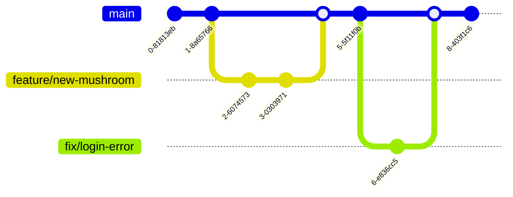

# Developer Guide

Welcome to the **Svamparnas Värld** developer documentation. This guide serves as the entry point for setting up your environment and understanding the development workflow.

## 🚀 Getting Started

Choose the setup guide for your operating system:

*   🐧 **[Setup for Debian 13 / Linux](docs/development/setup-debian.md)**
*   🪟 **[Setup for Windows 11](docs/development/setup-windows.md)**

## 📂 Project Structure

```text
/
├── app.py                  # Main Flask backend application
├── script.js               # Frontend logic
├── index.html              # Frontend markup
├── infra/                  # Infrastructure as Code
│   ├── main.bicep          # Azure Bicep template
│   └── scripts/            # Cloud-init scripts
├── .github/workflows/      # CI/CD Pipelines
└── deploy.sh               # Local deployment script
```

## 🛠 Workflow

We follow a simple **Feature Branch** workflow.



1.  **Branching:** Create a new branch for every feature or bugfix (e.g., `feature/new-mushroom`, `fix/login-error`).
2.  **Local Test:** Ensure the app runs locally using the instructions above.
3.  **Pull Request:** Push your branch and create a PR to `main`.
4.  **Deployment:** Merging to `main` triggers the GitHub Action to deploy infrastructure changes.

## 🚀 Deploying Code Changes (Application Updates)

We have two methods for deploying code changes:

### 1. Automated (Recommended)
Simply **push your changes to the `main` branch**.
*   A GitHub Action (`update-app.yml`) will automatically trigger.
*   It connects to the Backend VM using Azure Run Command.
*   It pulls the latest code and restarts the app.

### 2. Manual (Fallback)
If you need to trigger an update manually from your local machine (e.g., during troubleshooting):

1.  **Run the local update script:**
    From your project's root directory:
    ```bash
    ./update_code.sh
    ```
    This script tunnels through the Bastion Host to run the update commands.

## 🧪 Testing

*   **Backend:** (Add details about running unit tests here, e.g., `pytest`)
*   **Infrastructure:** Validate Bicep templates using:
    ```bash
    az bicep build --file infra/main.bicep
    ```

## 🤝 Need Help?

Check the [CONTRIBUTING.md](CONTRIBUTING.md) file for communication channels and Code of Conduct.
