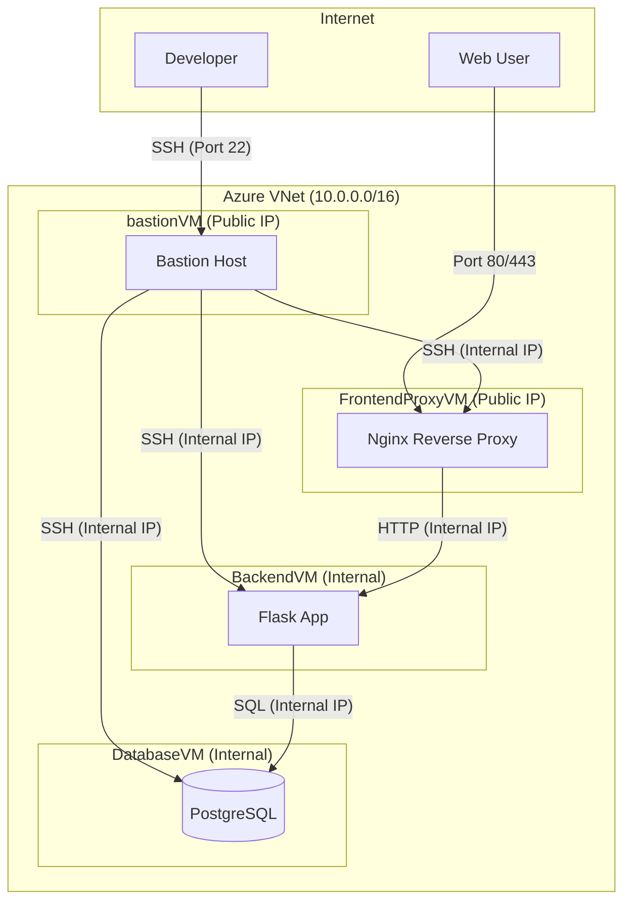

# Webinar Registration Project ("Svamparnas Värld")

This project is a full-stack web application for a fictional webinar, "Svamparnas Värld" (The World of Mushrooms). It includes a Python Flask backend, a PostgreSQL database, and a static HTML/CSS/JavaScript frontend. The entire infrastructure is provisioned on Microsoft Azure using Azure CLI scripts.

## Architecture

The infrastructure is designed with security and separation of concerns in mind, consisting of four virtual machines within a single Virtual Network.



### VM Roles

-   `FrontendProxyVM`: An Ubuntu VM running Nginx as a reverse proxy. It's the only machine that accepts public web traffic (Port 80) and forwards it to the `BackendVM`.
-   `BackendVM`: An Ubuntu VM running the Python Flask application. It processes requests and communicates with the `DatabaseVM`. It is not directly accessible from the internet.
-   `DatabaseVM`: A Debian 13 VM running PostgreSQL. It stores all application data and is only accessible from within the VNet.
-   `bastionVM`: A Debian 13 VM that serves as a secure jump-box. It's the only machine that accepts SSH traffic from the internet, providing a secure entry point for administrators.

---

## Infrastructure Deployment (Azure)

The entire infrastructure can be deployed with a single script.

### Prerequisites

-   [Azure CLI](https://docs.microsoft.com/en-us/cli/azure/install-azure-cli) installed and configured.
-   An active Azure subscription.
-   You must be logged in via `az login`.

### How to Deploy

Run the provisioning script from the root of the project:

```bash
./provision_vm.sh
```

The script will create all necessary resources, including the resource group, virtual network, and all four virtual machines. It will output the public IP addresses for the `bastionVM` and `FrontendProxyVM` upon completion.

### How to Access the Deployed Application

1.  **Web Application**: Navigate to the public IP address of the `FrontendProxyVM` in your web browser.
2.  **SSH / Administrative Access**:
    -   First, SSH into the bastion host using its public IP:
        ```bash
        ssh azureuser@<BASTION_PUBLIC_IP>
        ```
    -   From the bastion host, you can then connect to any of the other VMs using their internal private IP addresses (which are listed in the final table of the provisioning script output). For example, to reach the BackendVM:
        ```bash
        ssh azureuser@<BACKEND_PRIVATE_IP>
        ```

### How to Destroy the Infrastructure

To delete all created resources and avoid further charges, delete the entire resource group:

```bash
az group delete --name SvamparnasRG --no-wait --yes
```

---

## Local Development

You can run the Flask application on your local machine for development purposes.

### Prerequisites

-   Python 3.10+
-   A running PostgreSQL server (can be installed locally or via Docker).
-   The `venv` module for Python.

### Setup Instructions

1.  **Clone the Repository**
    ```bash
    git clone https://github.com/Butani89/webinar_project.git
    cd webinar_project
    ```

2.  **Create a Virtual Environment**
    ```bash
    python3 -m venv venv
    source venv/bin/activate
    ```

3.  **Install Dependencies**
    ```bash
    pip install -r requirements.txt
    ```

4.  **Configure the Database**
    -   Make sure your local PostgreSQL server is running.
    -   Create a user (`adminuser`) and a database (`webinar_db`) matching the credentials in `app.py`.
    -   Alternatively, you can change the `SQLALCHEMY_DATABASE_URI` in `app.py` to match your local setup.

5.  **Run the Application**
    Set the `DB_HOST` environment variable to `localhost` and run the Flask app:
    ```bash
    export DB_HOST=localhost
    python3 app.py
    ```
    The application will be running at `http://localhost:5000`.

6.  **View the Frontend**
    Open the `index.html` file in your web browser. It will make API calls to your locally running backend. Note that you may need to adjust the `fetch` URL in `script.js` if you are not running the app behind a local proxy.