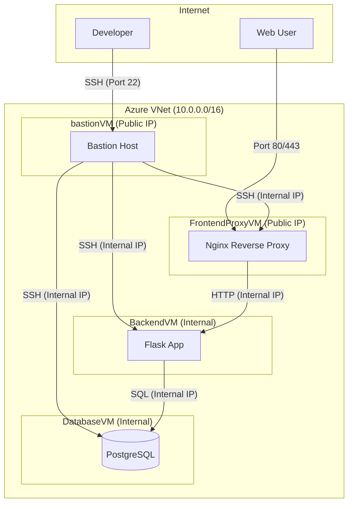

# Webinar Registration Project ("Svamparnas Värld")

This project is a full-stack web application for a fictional webinar, "Svamparnas Värld" (The World of Mushrooms). It includes a Python Flask backend, a PostgreSQL database, and a static HTML/CSS/JavaScript frontend. The entire infrastructure is provisioned on Microsoft Azure using Azure CLI scripts.

## Architecture

The infrastructure is designed with security and separation of concerns in mind, consisting of four virtual machines within a single Virtual Network.



### VM Roles

-   `FrontendProxyVM`: An Ubuntu VM running Nginx as a reverse proxy. It's the only machine that accepts public web traffic (Port 80) and forwards it to the `BackendVM`.
-   `BackendVM`: An Ubuntu VM running the Python Flask application. It processes requests and communicates with the `DatabaseVM`. It is not directly accessible from the internet.
-   `DatabaseVM`: A Debian 13 VM running PostgreSQL. It stores all application data and is only accessible from within the VNet.
-   `bastionVM`: A Debian 13 VM that serves as a secure jump-box. It's the only machine that accepts SSH traffic from the internet, providing a secure entry point for administrators.

---

## Deployment Guide

This section covers how to set up the project locally for development and how to deploy it to a production-like environment on Azure.

### 1. Local Development Environment (Linux)

Follow these steps to run the application on a local Linux machine (e.g., Ubuntu/Debian).

#### Prerequisites
Install the necessary system packages:
```bash
sudo apt update
sudo apt install python3 python3-pip python3-venv postgresql postgresql-contrib libpq-dev git -y
```

#### Step 1: Clone the Repository
```bash
git clone git@github.com:Butani89/webinar_project.git
cd webinar_project
```

#### Step 2: Configure the Database
Start the PostgreSQL service and create the dedicated user and database.

```bash
sudo systemctl start postgresql
sudo -u postgres psql -c "CREATE USER adminuser WITH PASSWORD 'Password123!';"
sudo -u postgres psql -c "CREATE DATABASE webinar_db OWNER adminuser;"
```

#### Step 3: Set Up Python Environment
Create a virtual environment to isolate dependencies.

```bash
python3 -m venv venv
source venv/bin/activate
pip install -r requirements.txt
```

#### Step 4: Run the Application
The application expects the `DB_HOST` environment variable. For local dev, we point it to `localhost`.

```bash
export DB_HOST=localhost
python3 app.py
```

The backend API will now be running at `http://localhost:5000`.

#### Step 5: Verify
Open `index.html` in your web browser.
> **Note:** Since `script.js` targets `/api/register`, you might need to use a simple HTTP server or open the file directly. If running without Nginx locally, ensure your browser allows the request or that you are testing the backend via `curl`.

---

### 2. Production Deployment (Azure)

We use **Infrastructure as Code (IaC)** to provision the entire stack on Azure. The `provision_vm.sh` script automates the creation of the Resource Group, VNet, Subnet, and all 4 Virtual Machines.

#### Prerequisites
-   **Azure CLI**: [Install Guide](https://docs.microsoft.com/en-us/cli/azure/install-azure-cli)
-   **Azure Subscription**: You must be logged in (`az login`).

#### Step 1: Run the Provisioning Script
This script creates the `SvamparnasRG` resource group and deploys the `bastionVM`, `FrontendProxyVM`, `BackendVM`, and `DatabaseVM`.

```bash
./provision_vm.sh
```
*Duration: Approximately 5-10 minutes.*

#### Step 2: Access the Application
Once the script completes, it will output a table of IP addresses.
1.  Copy the **Proxy Public IP**.
2.  Open your web browser and navigate to `http://<PROXY_PUBLIC_IP>`.
3.  You should see the "Svamparnas Värld" webinar page.

#### Step 3: Secure Administrative Access
To manage the internal servers (`BackendVM` or `DatabaseVM`), you must tunnel through the **Bastion Host**.

1.  **Connect to Bastion:**
    ```bash
    ssh azureuser@<BASTION_PUBLIC_IP>
    ```
2.  **Jump to Internal VM:**
    From the Bastion's terminal, SSH into the private IP of the target machine (displayed in the provisioning script output).
    ```bash
    # Example: Connect to Backend
    ssh azureuser@10.0.1.x
    ```

#### Step 4: Teardown
To remove all resources and stop billing:
```bash
az group delete --name SvamparnasRG --no-wait --yes
```
