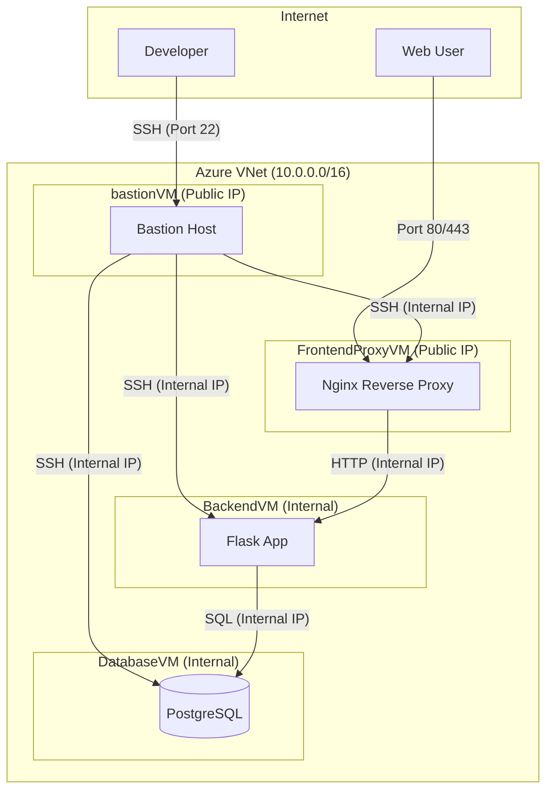

# Webinar Registration Project ("Svamparnas Värld")

This project is a full-stack web application for a fictional webinar, "Svamparnas Värld" (The World of Mushrooms). It includes a Python Flask backend, a PostgreSQL database, and a static HTML/CSS/JavaScript frontend. The entire infrastructure is provisioned on Microsoft Azure using Azure CLI scripts.

## Architecture

The infrastructure is designed with security and separation of concerns in mind, consisting of four virtual machines within a single Virtual Network.



### VM Roles

-   `FrontendProxyVM`: A Debian 13 VM running Nginx as a reverse proxy. It's the only machine that accepts public web traffic (Port 80/443) and forwards it to the `BackendVM`.
-   `BackendVM`: A Debian 13 VM running the Python Flask application. It processes requests and communicates with the `DatabaseVM`. It is not directly accessible from the internet.
-   `DatabaseVM`: A Debian 13 VM running PostgreSQL. It stores all application data and is only accessible from within the VNet.
-   `bastionVM`: A Debian 13 VM that serves as a secure jump-box. It's the only machine that accepts SSH traffic from the internet, providing a secure entry point for administrators.

---

## Deployment

We support both manual deployment (for testing) and automated CI/CD (for production).

*   **[Infrastructure Architecture](docs/deployment/architecture.md):** Learn about the VNet, VMs, and Security.
*   **[Manual Deployment Guide](docs/deployment/manual.md):** How to deploy using the CLI scripts.
*   **[CI/CD Guide](docs/deployment/ci-cd.md):** How to set up GitHub Actions for automation.

### Quick Start (Manual)

1.  **Prerequisites:** Azure CLI installed and logged in.
2.  **Run:**
    ```bash
    ./deploy.sh
    ```

