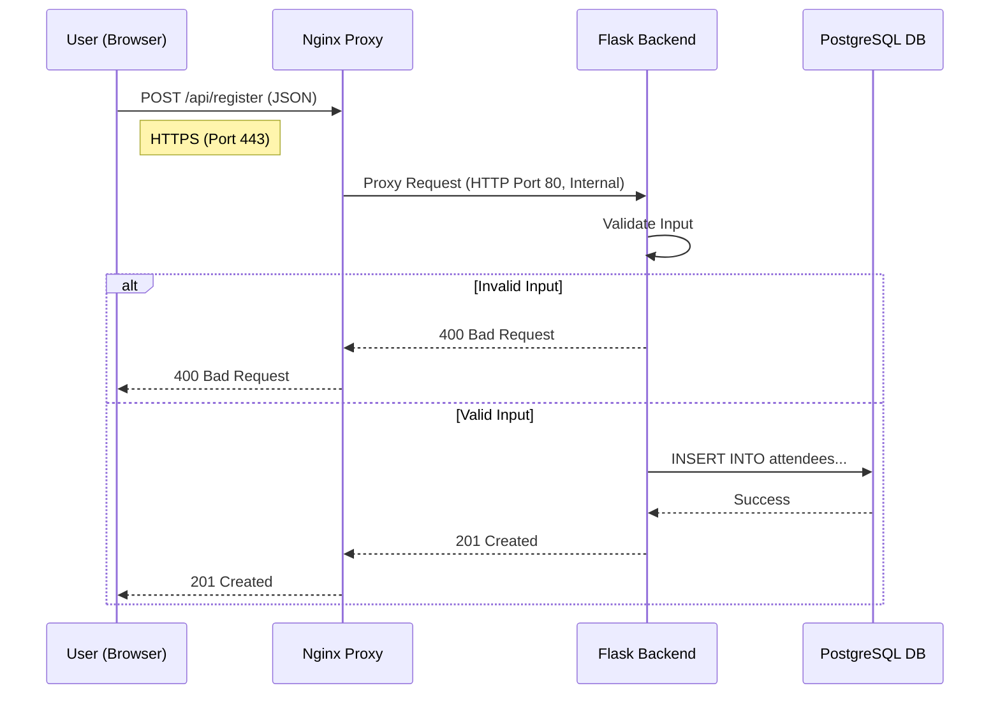

# Infrastructure Architecture

This document describes the cloud infrastructure for "Svamparnas Värld", provisioned on **Microsoft Azure**.

## High-Level Overview

The infrastructure follows a **tiered architecture** to ensure security and separation of concerns. All resources are defined as code using **Azure Bicep** (`infra/main.bicep`).

```mermaid
graph TD;
    subgraph "Internet"
        User_Web[Web User]
        Developer[Developer]
        GH_Action[GitHub Actions]
    end

    subgraph "Azure Resource Group"
        subgraph "Virtual Network (10.0.0.0/16)"
            subgraph "Public Subnet"
                Proxy[FrontendProxyVM (Debian 13)]
                Bastion[bastionVM (Debian 13)]
            end

            subgraph "Private Subnet (Virtual)"
                Backend[BackendVM (Debian 13)]
                DB[DatabaseVM (Debian 13)]
            end
        end
    end

    User_Web -- HTTPS (443) --> Proxy
    Developer -- SSH (22) --> Bastion
    GH_Action -- ARM Deployment --> Azure Resource Group

    Proxy -- Reverse Proxy (80) --> Backend
    Backend -- SQL (5432) --> DB
    Bastion -- SSH Tunnel --> Proxy
    Bastion -- SSH Tunnel --> Backend
    Bastion -- SSH Tunnel --> DB
```

### Data Flow: User Registration

The following sequence diagram illustrates how a user registration request travels through the system.



## Components

### 1. Network & Security
*   **Virtual Network (VNet):** A single VNet (`SvampVNet`) containing all resources.
*   **Network Security Groups (NSGs):**
    *   `ProxyNSG`: Allows Inbound HTTP (80) and HTTPS (443).
    *   `BastionNSG`: Allows Inbound SSH (22).
    *   `InternalNSG`: Blocks direct internet access to Backend and Database. Only allows traffic within the VNet.

### 2. Virtual Machines (Debian 13)

| Server | Role | Public Access | Notes |
| :--- | :--- | :--- | :--- |
| **FrontendProxyVM** | Nginx Reverse Proxy | Yes (80/443) | Handles SSL termination (Certbot) and forwards requests to Backend. Updates DuckDNS IP. |
| **bastionVM** | Jump Host | Yes (22) | The *only* entry point for SSH management. |
| **BackendVM** | Python Flask App | No | Runs the application logic. Connects to Database. |
| **DatabaseVM** | PostgreSQL Database | No | Stores application data. |

## Secrets Management

We do **not** store secrets in source code.

*   **Database Password:** Generated randomly at runtime (during deployment) or passed via GitHub Secrets. Injected into VMs via Bicep `customData`.
*   **DuckDNS Token:** Passed as a secure parameter during deployment.
*   **SSH Keys:** Public keys are injected during provisioning.

## Configuration Management

We use **Cloud-init** (via Bicep `customData` property) to configure VMs on first boot:
1.  Updates `apt` packages.
2.  Installs software (Nginx, Python, Postgres).
3.  Injects environment variables (`DB_HOST`, `DB_PASSWORD`).
4.  Sets up systemd services.
