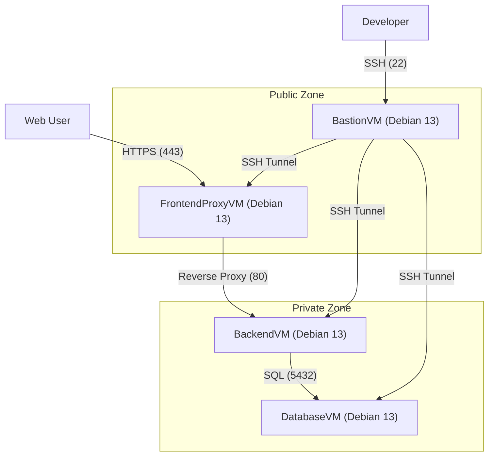

# Infrastructure Architecture

This document describes the platform-agnostic infrastructure for "Svamparnas Värld". The system allows deployment to **Azure**, **Proxmox**, or a **Local Docker** environment using **OpenTofu**.

## High-Level Overview

The infrastructure defines a standard topology regardless of the underlying provider.

- **Provisioning**: OpenTofu (`infra/opentofu/`)
- **Configuration**: Ansible (`infra/ansible/`)

## Components

### 1. Virtual Machines / Containers (Debian 13)

| Server | Role | Access | Notes |
| :--- | :--- | :--- | :--- |
| **FrontendProxyVM** | Nginx Reverse Proxy | Public 80/443 | Terminates SSL (Let's Encrypt), updates DuckDNS, proxies to Backend. |
| **BastionVM** | Jump Host | Public 22 | Single entry point for SSH management. |
| **BackendVM** | Django + Gunicorn | Private | Runs the application logic and API. |
| **DatabaseVM** | PostgreSQL | Private | Stores application data. |

### 2. Networking

*   **Azure**: Uses a VNet with NSGs strictly controlling access.
*   **Proxmox**: Uses Linux Bridges/VLANs to isolate the private zone.
*   **Local**: Uses a shared Docker Network.

## Configuration Management (Ansible)

Unlike the previous Cloud-init setup, we now use **Ansible** for full lifecycle management.

### Roles
1.  **`common`**: Installs basic tools (`vim`, `curl`, `git`) and sets Timezone.
2.  **`database`**: Installs PostgreSQL, creates the DB/User, and configures `pg_hba.conf` to allow access from the internal subnet.
3.  **`backend`**:
    *   Installs Python, Node.js, Nginx.
    *   Clones the repository.
    *   Builds Frontend assets.
    *   Migrates Database.
    *   Configures Systemd for Gunicorn.
4.  **`proxy`**:
    *   Installs Nginx, Certbot.
    *   Configures DuckDNS cron job.
    *   Obtains SSL Certificates.

## Secrets Management

Secrets are injected at runtime via environment variables or Ansible Vault (future improvement).

*   **Database Credentials**: Passed to Ansible execution.
*   **DuckDNS Token**: Passed to the Proxy role.