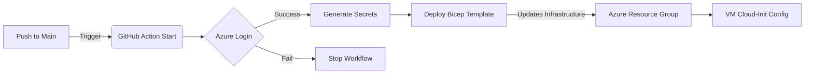

# Continuous Deployment (CI/CD)

We use **GitHub Actions** to automatically deploy infrastructure changes whenever code is pushed to the `main` branch.

## Workflow Overview

The workflow file is located at: `.github/workflows/deploy.yml`

**Trigger:** Push to `main` branch.

**Important Note:** This CI/CD pipeline is designed for **infrastructure deployment** (Bicep templates). It will ensure your Azure resources match your Bicep definitions. However, it does *not* automatically update application code on existing running Virtual Machines. For **application code updates**, refer to the "Deploying Code Changes" section in the [Developer Guide](../../DEVELOPER_GUIDE.md).

**Steps:**
1.  **Checkout Code:** Pulls the latest repository version.
2.  **Azure Login:** Authenticates using a Service Principal (Secret-based).
3.  **Generate Secrets:** Creates a fresh, random password for the database for this deployment run.
4.  **Deploy Bicep:** Runs `az deployment group create` to apply the state defined in `infra/main.bicep`.

## Setup Instructions

If you fork this repository, you must configure the following **GitHub Secrets** for the pipeline to work.

### 1. Azure Credentials
You need a Service Principal with `Contributor` access to your subscription.

Required Secrets:
*   `AZURE_CLIENT_ID`: The App ID of the Service Principal.
*   `AZURE_CLIENT_SECRET`: The password/secret for the Service Principal.
*   `AZURE_TENANT_ID`: Your Azure Tenant ID.
*   `AZURE_SUBSCRIPTION_ID`: Your Azure Subscription ID.

### 2. Application Secrets
*   `SSH_PUBLIC_KEY`: The content of your `~/.ssh/id_rsa.pub`. This key will be added to all VMs for SSH access.
*   `DUCKDNS_TOKEN`: Your DuckDNS API token (used to update the domain IP).

## Troubleshooting

### "QuotaExceeded" Error
If the deployment fails with a Quota error, check your Azure region's limits for the VM SKU (e.g., `Standard_B2s_v2`). You may need to request a quota increase or change the region in `deploy.sh` (for manual) or the Bicep parameters.

### Certificate Issues
The pipeline deploys the infrastructure, but the SSL certificate generation happens *inside* the Proxy VM on boot.
*   Check the logs on the Proxy VM: `/var/log/cloud-init-output.log`
*   Ensure DuckDNS is pointing to the correct IP.
